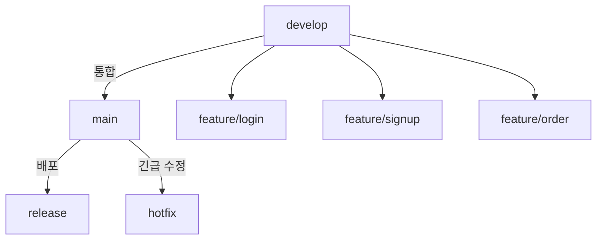
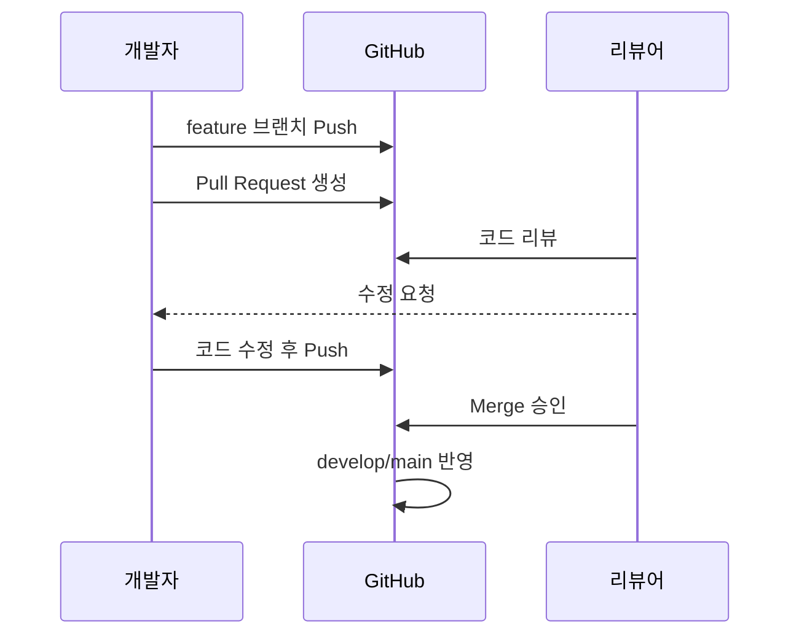

# 🤝 Contributing to Routy

Routy 프로젝트에 기여해 주셔서 감사합니다!  
모든 협업자는 아래의 브랜치 규칙, 커밋 규칙, PR 프로세스를 따라주세요.

---

## 🌿 브랜치 구조

| 브랜치               | 용도                       | 비고                                     |
| -------------------- | -------------------------- | ---------------------------------------- |
| `main`               | 🚀 배포용 (항상 안정 상태) | 직접 push 금지 (보호 브랜치)             |
| `develop`            | 🧩 기본 개발 브랜치        | feature 브랜치 병합 대상                 |
| `feature/*`          | ✏️ 기능 개발용             | 예: `feature/login`, `feature/header-ui` |
| `fix/*` / `hotfix/*` | 🐞 버그 수정용             | 긴급 수정은 `hotfix`로 생성              |

---

### 🔁 브랜치 흐름 (Git Flow)



---

## ⚙️ 기본 규칙

1. **기본 브랜치**는 `develop`입니다. 새로 클론하면 자동으로 `develop`이 활성화됩니다.
2. 모든 개발은 `feature/*` 브랜치에서 진행하세요.
3. `main` 브랜치에는 직접 push하지 마세요. `develop → main` PR만 허용됩니다.
4. PR은 반드시 **리뷰 승인 + CI 통과 후 병합(Squash merge)** 해야 합니다.

---

## 🏷️ 커밋 메시지 규칙

### 📌 기본 원칙

1. 제목과 본문은 한 줄 띄워 구분
2. 제목은 50자 이내
3. 제목 첫 글자는 대문자, 마침표 금지
4. 명령형으로 작성 (ex: Add, Fix, Update)
5. 본문은 72자 이내로 줄바꿈
6. 본문은 “무엇(What)”과 “왜(Why)” 중심

### 🧱 형식

```
타입(스코프): 제목

본문 (선택)

푸터 (선택)
```

### ✏️ 예시

```
fix: Safari에서 모달 스크롤 이슈 수정

모바일 Safari 환경에서 모달을 띄웠을 때
배경 스크롤이 움직이는 문제를 수정함.

resolves: #1137
```

### 🏷️ 커밋 타입

| 타입       | 설명                        |
| ---------- | --------------------------- |
| `feat`     | 새로운 기능 추가            |
| `fix`      | 버그 수정                   |
| `build`    | 빌드 관련 설정 변경         |
| `chore`    | 코드 외 변경(문서, 설정 등) |
| `ci`       | CI 설정 변경                |
| `docs`     | 문서 수정                   |
| `style`    | 포맷 변경 (로직 변화 없음)  |
| `refactor` | 코드 리팩토링               |
| `test`     | 테스트 코드 추가/수정       |
| `perf`     | 성능 개선                   |

---

## 🔧 개발 흐름 (Git Flow)

```bash
# 1️⃣ develop 최신화
git checkout develop
git pull

# 2️⃣ 새 기능 브랜치 생성
git checkout -b feature/<기능명>

# 3️⃣ 작업 및 커밋
git add .
git commit -m "feat: 기능 설명"

# 4️⃣ 원격에 푸시
git push -u origin feature/<기능명>

# 5️⃣ GitHub에서 PR 생성 (feature → develop)
```

> PR 제목 예시: `feat: 로그인 페이지 구현 (#12)` / `fix: 회원가입 유효성 검사 추가 (#17)`

---

## 🧪 릴리스 (Release)

1. `develop`에서 테스트 완료 후 `main`으로 PR 생성 (base: `main`, compare: `develop`)
2. 리뷰 & CI 통과 후 **Squash Merge**
3. 버전 태그 추가

```bash
git checkout main
git pull
git tag -a vX.Y.Z -m "Release vX.Y.Z"
git push origin vX.Y.Z
```

---

## 🔁 Pull Request 프로세스

1. Issue 생성 → 담당자 지정
2. feature 브랜치 생성 후 작업
3. Commit & Push
4. Pull Request 생성 → 리뷰 요청
5. 리뷰 후 승인 및 Merge (Squash)



---

## ⚔️ PR 전 Conflict 미리 해결하기 (Rebase 권장)

PR 생성 전에 `develop` 브랜치와의 충돌을 미리 해결해주세요.  
이 과정을 거치면 리뷰어가 바로 머지할 수 있고, 불필요한 Conflict를 줄일 수 있습니다.

````bash
# 1️⃣ develop 최신화
git fetch origin

# 2️⃣ feature 브랜치로 이동
git checkout feature/<기능명>

# 3️⃣ develop 최신 커밋 위로 재배치 (rebase)
git rebase origin/develop

💥 충돌(conflict)이 발생하면:

git status  # 충돌 파일 확인
git add <파일명>
git rebase --continue

모두 해결되면:

git push -f origin feature/<기능명>

✅ 이 과정을 거치면 PR 시 Able to merge 상태가 유지되어
리뷰어가 추가 조치 없이 바로 Merge할 수 있습니다.

---

## 💡 결과 구조 예시
최종적으로는 문서의 큰 구조가 이렇게 됩니다 👇

---

## 🧱 PR 머지 방식

- Routy는 **Squash Merge**를 기본으로 사용합니다. (여러 커밋을 하나로 압축)
- **Merge commit은 사용하지 않습니다.**
- Rebase merge는 숙련자만 선택적으로 사용 가능합니다.

---

## 🏷️ 라벨 규칙

| 분류                   | 예시                                                 |
| ---------------------- | ---------------------------------------------------- |
| **유형(Type)**         | `type: bug`, `type: feature`, `type: docs`           |
| **우선순위(Priority)** | `P0-긴급`, `P1-높음`, `P2-보통`, `P3-낮음`           |
| **상태(Status)**       | `status: ready`, `status: review`, `status: blocked` |
| **영역(Area)**         | `area: frontend`, `area: backend`, `area: infra`     |

> 표기법: 소문자 + 콜론(`:`) 형식
> 예: `type: bug`, `status: review`

---

## 🧩 긴급 수정 (Hotfix)

```bash
# 1️⃣ main에서 분기
git checkout main
git pull
git checkout -b hotfix/<이슈명>

# 2️⃣ 수정 및 푸시
git add .
git commit -m "hotfix: 긴급 수정 내용"
git push -u origin hotfix/<이슈명>

# 3️⃣ PR 생성 (hotfix → main)
# 4️⃣ main에 병합 후 develop에도 반영 (PR: main → develop)
````

---

## ⚠️ 협업 원칙

- 🚫 `main` 브랜치에 직접 커밋 금지
- ✅ 모든 변경은 PR(Pull Request)로 진행
- 🧩 기능 단위로 feature 브랜치 생성
- 🧹 커밋은 의미 단위로 작게 분리
- 🧾 커밋 메시지는 통일된 규칙 유지
- 🗂️ 코드 리뷰는 최소 1명 이상 승인 필수

---

감사합니다 🙌  
`main`은 안정성을, `develop`은 생산성을 지향합니다.  
함께 좋은 코드 문화를 만들어가요.
